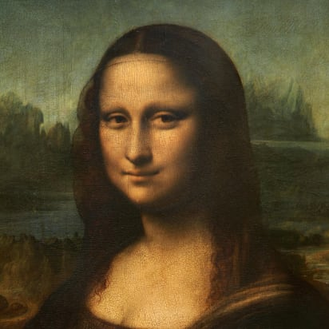

# SSC0713-Sistemas Evolutivos Aplicados à Robótica

<h1 align="center"> Projeto Monalisa </h1>

## Grupo
- Tsuyoshi Sonobe - 10739246
- Thallys  Oliveira - 11819827
- Catarina Barros - 11819636

**Vídeo explicando o trabalho:** [link](https://drive.google.com/file/d/1iRKTzDxSZjpmnltM0FncT3WlRqZ6nahT/view?usp=sharing)

## Motivação
Quando iniciamos a matéria, pensamos no que queríamos fazer e nada veio à mente. Desse modo, buscamos ideias na internet e encontramos o seguinte artigo: [link](https://medium.com/analytics-vidhya/2d-image-reconstruction-using-genetic-algorithm-e6ab1c2ea073). Um algoritmo genético que reconstrói uma imagem 2D, mas buscando um lado **mais lúdico**, sem uma utilidade necessária, porém interessante. Desta forma buscamos inspiração na **arte** e **desenvolvemos um algoritmo genético que reconstrói uma imagem 2D da Monalisa em escalas de cinza**. 

	

## Para rodar o código
- Indicamos utilizar o VsCode (Visual Studio Code) da Microsoft como editor de código e o Visual Studio Code Community como interpretador. Além disso, é necessário configurar o computador para executar programas em C++.
  - Como Baixar e Configurar VS Code para Compilar C/C++: [link](https://www.youtube.com/watch?v=WHyxv69ZAf0&t=11s&ab_channel=ProgramandooFuturo) 
  - Obs.: Na instalação do Visual Studio Code Community, instalar dependências relacionadas a C++
- Para executar o código, não somente é preciso instalar e configurar a biblioteca OpenCV (necessária para trabalhar com imagens), como também o Cmake (sistema multiplataforma para realizar geração automatizada).
  - How To Install OpenCV C++ and Set It Up in Visual Studio Code with CMake: [link](https://www.youtube.com/watch?v=WHyxv69ZAf0&t=11s&ab_channel=ProgramandooFuturo)
- Depois que tudo acima foi instalado, é possível executar o código.
